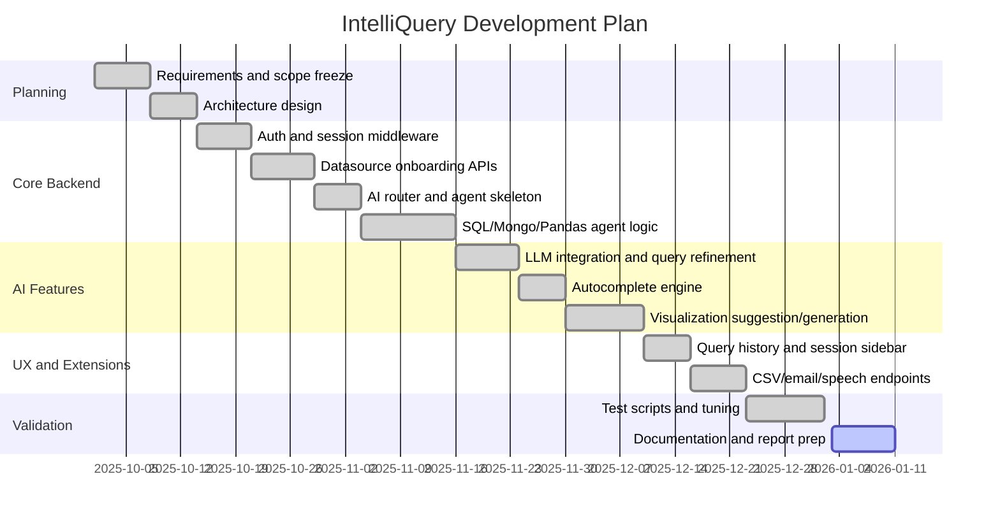
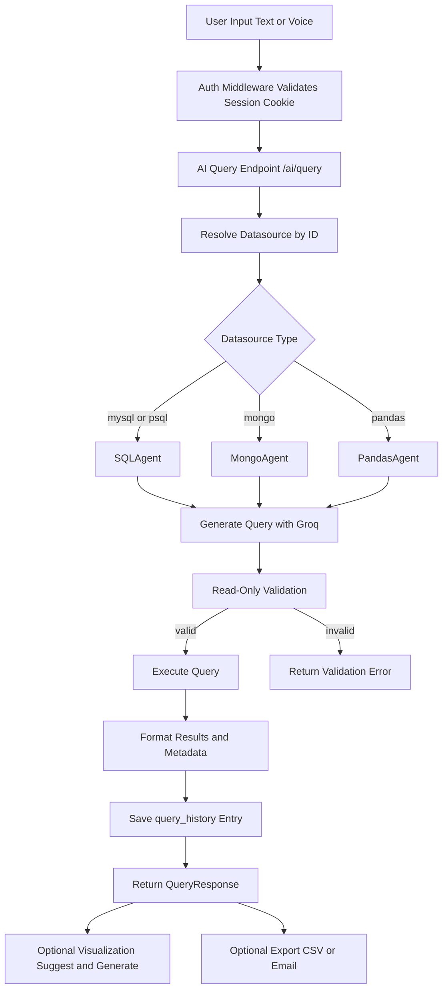
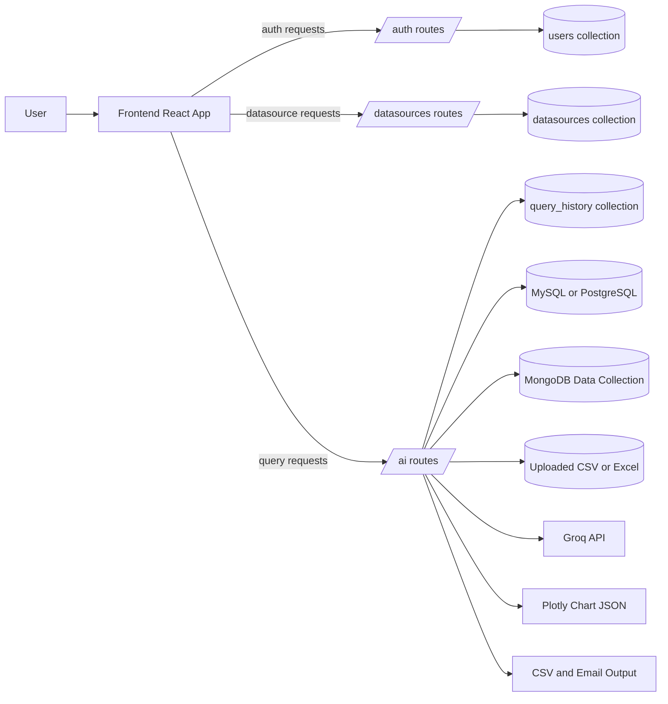
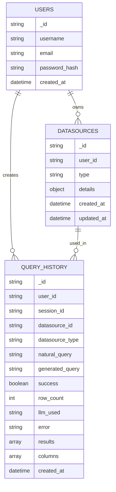
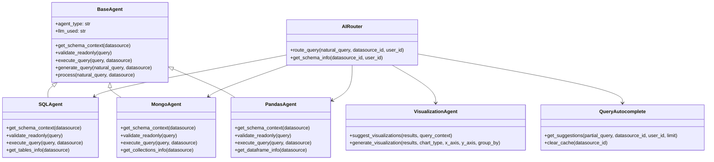
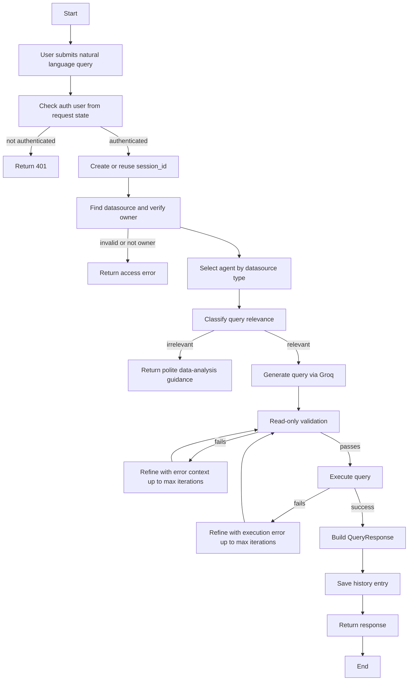
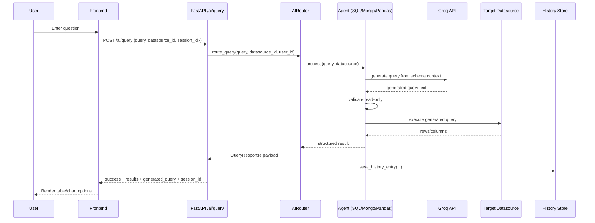

# IntelliQuery (Voxalize) Report-Ready README

This document is intentionally detailed and structured so another AI agent (or student team) can expand it into a 30-40 page academic or project report without re-reading the full codebase.

The structure below follows the requested format:

- 1. INTRODUCTION
- 2. LITERATURE REVIEW
- 3. SYSTEM REQUIREMENT AND ANALYSIS
- 4. TOOLS AND TECHNOLOGY USED
- 5. SYSTEM DESIGN AND ARCHITECTURE
- 6. IMPLEMENTATION AND SNAPSHOTS

## Suggested Pagination Plan (for final report)

Use this mapping while converting to the final report PDF:

- Introduction: pages 1-10
- Literature Review: pages 11-12
- System Requirement and Analysis: pages 13-14
- Tools and Technology Used: pages 15-16
- System Design and Architecture: pages 16-22
- Implementation and Snapshots: pages 23-34
- Testing, limitations, future scope, conclusion, references, appendix: pages 35-40

---

## 1. INTRODUCTION

### 1.1 Problem Statement

Modern teams use multiple kinds of data stores at the same time:

- Relational databases (MySQL/PostgreSQL)
- Document databases (MongoDB)
- Flat files (CSV/Excel) for business-side analysis

Most users who need insights from these systems are not experts in SQL, MongoDB query syntax, or Pandas code. This creates a dependency bottleneck where business users must wait for technical users to write queries.

The core problem solved by IntelliQuery is:

- Convert natural language (and speech) into safe, executable queries for multiple datasource types
- Execute only read-only operations to prevent accidental data modification
- Return results in a usable structure and generate visualizations
- Keep user sessions/history and support real-time query autocomplete

Key practical challenge in this domain:

- LLMs can generate invalid or unsafe queries
- Different backends require different execution logic
- Multi-tenant systems need strict auth + datasource ownership checks
- Query outputs need to be visualized and optionally exported/shared

IntelliQuery addresses these with a backend-centric architecture built on FastAPI + agent routing + layered validation.

### 1.2 Objectives

Primary objectives of this project:

1. Build a unified backend API for NL-to-query execution across SQL, MongoDB, and Pandas datasources.
2. Enforce strict read-only query constraints at agent level.
3. Provide secure user authentication using JWT cookie sessions.
4. Enable datasource onboarding (SQL connect, Mongo connect, file upload for Pandas).
5. Support visualization suggestion and chart generation from query results.
6. Support query autocomplete based on datasource schema.
7. Persist query history by session for chat-like workflows.
8. Support export and collaboration features (CSV export, email results, speech-to-text input).

Secondary objectives:

- Keep modules separated for easier extension
- Keep request/response schemas explicit with Pydantic models
- Add test scripts for major capability areas

### 1.3 Applications

Typical applications for IntelliQuery:

- Business analytics assistant for non-technical users
- Internal data exploration tool for startups and SMB teams
- Educational platform for teaching query concepts using NL input
- Rapid ad-hoc analysis over uploaded CSV/Excel files
- Unified analytics gateway for mixed SQL + Mongo data landscapes

Potential domain usage:

- Sales analytics
- Operations reporting
- Customer behavior analysis
- Inventory and order tracking
- Regional performance dashboards

### 1.4 Existing Solution

Common existing categories:

1. SQL-only conversational BI tools
2. Standalone dashboard tools requiring manual query setup
3. Single-backend LLM demos with weak safety controls

Observed gaps (that IntelliQuery targets):

- No native multi-backend unification in one NL query endpoint
- Limited query safety guardrails
- Limited extensibility and transparency
- Weak support for Pandas/Excel data workflows
- Minimal built-in support for sessionized chat history and export in one backend

### 1.5 Proposed Solution

IntelliQuery proposes a modular backend architecture:

- FastAPI service as control plane
- Auth layer for session identity
- Datasource manager for connection metadata
- AI router that dispatches queries by datasource type
- Specialized agents per backend:
  - SQLAgent
  - MongoAgent
  - PandasAgent
- Shared LLM integration (Groq)
- Visualization agent (suggest + generate charts)
- Autocomplete engine (schema-aware + cache)
- History store for session continuity
- Export/speech integrations

Core design principle:

- One user query path, multiple backend-specific executors, and strict read-only safety before execution.

### 1.6 Gantt Chart

Use this implementation-aligned Gantt representation in the report.

---

## 2. LITERATURE REVIEW

### 2.1 Literature Survey

This project sits at the intersection of:

- Text-to-query generation
- Conversational analytics
- Multi-datasource data access
- LLM safety and controllability

Survey themes to include in final report:

1. Text-to-SQL benchmarks and methods
2. Conversational BI platforms and limits
3. Agentic architecture for tool execution
4. Data safety and read-only enforcement approaches

Practical synthesis from code-level perspective:

- IntelliQuery uses prompt-based generation plus deterministic validation.
- It does not trust LLM output directly.
- It introduces iterative refinement (up to 3 passes) after validation or execution errors.
- It extends beyond SQL by implementing separate execution and validation logic for MongoDB and Pandas.

Recommended literature pointers for final report references:

- WikiSQL, Spider, BIRD benchmarks
- LangChain agent/tooling patterns
- Prompt engineering for structured output
- Enterprise safe-query systems and database governance

---

## 3. SYSTEM REQUIREMENT AND ANALYSIS

### 3.1 System Analysis

#### 3.1.1 Functional Requirements

Authentication and user management:

- Register user
- Login user
- Set/clear secure session cookie
- Resolve current user from cookie middleware

Datasource management:

- Connect to MySQL/PostgreSQL and validate with SELECT 1
- Connect to MongoDB and validate DB + collection availability
- Upload CSV/Excel and validate it loads in Pandas
- List and delete datasources per user

AI query workflows:

- Execute NL query via /ai/query
- Route by datasource type
- Generate SQL/Mongo/Pandas query via Groq
- Validate read-only
- Execute and return results
- Persist session history

Analytics augmentation:

- Suggest visualizations from resultset
- Generate requested chart as Plotly JSON
- Provide autocomplete suggestions while typing

Additional utility features:

- Session history list/fetch/delete
- CSV export
- Email results with optional chart image
- Speech-to-text for voice input

#### 3.1.2 Non-Functional Requirements

Security:

- PBKDF2 password hashing
- JWT signed token in HTTP-only cookie
- Datasource ownership validation before query execution
- Password encryption in datasource metadata storage

Reliability:

- Startup Mongo ping and index preparation
- Fallback behavior for autocomplete and chart suggestions
- Structured errors with HTTP status mapping

Performance:

- Cached schema and suggestion generation in autocomplete
- Query result size caps in history persistence and some agent executions

Maintainability:

- Modular folder structure
- Per-domain routers/schemas/stores
- Reusable BaseAgent abstraction

#### 3.1.3 User Roles

- Authenticated end user: connect datasources, ask queries, view history, export/share results
- System maintainer/admin (implicit): configure env vars, monitor logs, tune LLM and datasource settings

#### 3.1.4 Constraints and Assumptions

- Groq API key required for full AI capabilities
- MongoDB required for app metadata and history
- SQL execution requires network-accessible DB and valid credentials
- Pandas mode requires uploadable file and memory capacity

---

## 4. TOOLS AND TECHNOLOGY USED

### 4.1 Tools and Technology

#### 4.1.1 Backend Framework and Runtime

- FastAPI
- Uvicorn
- Python 3.11 virtual environment (observed)

#### 4.1.2 Databases and Data Engines

- MongoDB via PyMongo (users, datasources, query_history)
- MySQL via SQLAlchemy + PyMySQL
- PostgreSQL via SQLAlchemy + psycopg2
- Pandas for CSV/Excel query execution context

#### 4.1.3 AI/LLM Stack

- Groq Python SDK
- Primary model: meta-llama/llama-4-scout-17b-16e-instruct
- Secondary model in autocomplete: llama-3.3-70b-versatile

#### 4.1.4 Visualization and Reporting

- Plotly Express + Graph Objects
- Kaleido (for chart image conversion in email flow)

#### 4.1.5 Security and Identity

- Passlib PBKDF2_SHA256
- PyJWT HS256
- Cryptography/Fernet for datasource password encryption

#### 4.1.6 Supporting Libraries (from requirements)

- python-dotenv
- python-multipart
- httpx
- faker
- matplotlib
- langchain (present dependency)

#### 4.1.7 Frontend (for system completeness)

- React + Vite
- Axios API client with credentials
- Route-level protected pages

#### 4.1.8 Development and Testing Assets

- Scripted test files for autocomplete, mongo data, excel data, visualization
- Demo data generators and guides

---

## 5. SYSTEM DESIGN AND ARCHITECTURE

### 5.1 Workflow

Main runtime workflow:

1. User authenticates.
2. User connects/selects datasource.
3. User submits text or speech-derived query.
4. Backend validates user + datasource ownership.
5. AI router dispatches to specific agent.
6. Agent extracts schema context.
7. LLM generates query.
8. Agent validates query as read-only.
9. Agent executes query.
10. Backend persists query history.
11. Frontend displays tabular result.
12. Optional: get visualization suggestions and generate chart.
13. Optional: export CSV/email results.

### 5.2 Data Flow Diagram

### 5.3 ER Diagram

### 5.4 UML Diagram

### 5.5 Activity Diagram

### 5.6 Sequence Diagram

### 5.7 API Surface Summary (for report appendix)

Authentication endpoints:

- POST /auth/register
- POST /auth/login
- POST /auth/logout
- GET /auth/me

Datasource endpoints:

- GET /datasources/
- POST /datasources/sql/connect
- POST /datasources/mongo/connect
- POST /datasources/pandas/upload
- DELETE /datasources/{datasource_id}

AI endpoints:

- POST /ai/query
- GET /ai/schema/{datasource_id}
- GET /ai/health
- POST /ai/visualize/suggest
- POST /ai/visualize/generate
- POST /ai/autocomplete
- DELETE /ai/autocomplete/cache/{datasource_id}
- GET /ai/history
- GET /ai/history/{session_id}
- DELETE /ai/history/{session_id}
- POST /ai/speech-to-text
- POST /ai/export/csv
- POST /ai/export/email

---

## 6. IMPLEMENTATION AND SNAPSHOTS

### 6.1 System Implementation

This section is implementation-grounded and can be expanded into long-form chapters.

#### 6.1.1 Backend Entry and Boot Lifecycle

Implemented in backend/app.py:

- Loads environment variables
- Configures logging
- Initializes FastAPI app metadata
- Applies conditional CORS middleware
- Applies AuthMiddleware globally
- Registers routers: auth, datasources, ai
- Startup tasks:
  - ping_db()
  - ensure_indexes() for users collection
  - Groq client status logging

#### 6.1.2 Authentication and Session Management

Auth stack implementation details:

- Register:
  - Validates payload with Pydantic
  - Hashes password using pbkdf2_sha256
  - Persists user with unique email/username enforcement
- Login:
  - Verifies credentials
  - Issues JWT with sub, iat, exp
  - Stores JWT in HTTP-only cookie
- Middleware:
  - Reads cookie on each request
  - Decodes token
  - Resolves public user and injects request.state.user
- require_user dependency:
  - Enforces auth on protected endpoints

#### 6.1.3 Datasource Management

SQL onboarding:

- Supports mysql and psql
- Builds SQLAlchemy URL dynamically
- Executes SELECT 1 to validate connectivity
- Saves encrypted credentials in datasources collection

Mongo onboarding:

- Connects using URI
- Pings admin database
- Validates specified collection exists in target DB
- Saves datasource metadata

Pandas onboarding:

- Accepts csv/xlsx/xls uploads
- Stores in per-user folder under data/uploads/{user_id}
- Reads via Pandas to validate file integrity
- Stores filename/path/shape/columns as datasource details

#### 6.1.4 Query Execution Pipeline and Agent Behavior

BaseAgent pipeline includes:

- Relevance classification
- Initial query generation
- Validation-driven refinement loop
- Execution-driven refinement loop
- Response normalization

SQLAgent behavior:

- Extracts schema from inspector (tables, columns, PK/FK)
- Blocks unsafe SQL keywords and multi-statements
- Executes with SQLAlchemy and serializes values

MongoAgent behavior:

- Infers schema by sampling collection docs
- Parses generated JSON into operation format
- Allows only find/aggregate/count/distinct
- Adds default limits for result safety

PandasAgent behavior:

- Loads DataFrame from configured file
- Validates against forbidden patterns and AST
- Executes in restricted namespace
- Returns DataFrame/Series/scalar/list as serializable records

#### 6.1.5 Visualization Implementation

Visualization suggestion:

- Converts results to DataFrame
- Analyzes column data types and structure
- Requests ranked chart recommendations from Groq
- Falls back to rule-based suggestions on parse failure

Visualization generation:

- Supports 13 chart types
- Applies optional x/y/group_by/customization inputs
- Returns Plotly JSON + frontend config

#### 6.1.6 Autocomplete Implementation

Autocomplete engine:

- Handles short input with starter suggestions
- Uses schema cache and suggestion cache
- Validates datasource ownership
- Generates NL suggestions with low-latency prompt
- Uses fallback keyword suggestion templates on error

#### 6.1.7 History, Export, and Speech Extensions

History:

- Creates new session_id when absent
- Persists each exchange in query_history
- Lists sessions by latest activity
- Fetches ordered session messages
- Supports session deletion

Export:

- CSV endpoint converts list-of-dicts to download stream
- Email endpoint sends CSV and optional chart image via SMTP

Speech:

- Validates audio content type and size (max 25 MB)
- Uses Groq whisper-large-v3 for transcription
- Auto-translates non-English to English

### 6.2 Snapshots

Use this section as final-report snapshot checklist. Replace placeholders with actual screenshots while writing the final PDF.

#### 6.2.1 UI and Flow Snapshots (Frontend)

Capture these screens:

1. Home page
2. Register page
3. Login page
4. Dashboard showing quick actions and saved datasources
5. SQL datasource setup form
6. Mongo datasource setup form
7. Spreadsheet upload setup form
8. Query page with chat panel and session sidebar
9. Query result table rendering
10. Visualization suggestion list and rendered chart
11. Session history load and replay

#### 6.2.2 API and Backend Snapshots

Capture these evidence points:

1. /auth/register success response
2. /auth/login response + cookie set
3. /datasources/sql/connect success
4. /datasources/mongo/connect success
5. /datasources/pandas/upload success
6. /ai/query with SQL datasource
7. /ai/query with Mongo datasource
8. /ai/query with Pandas datasource
9. /ai/visualize/suggest response payload
10. /ai/visualize/generate chart JSON payload
11. /ai/autocomplete response in typing flow
12. /ai/history listing and /ai/history/{session_id}
13. /ai/export/csv download
14. /ai/export/email success
15. /ai/speech-to-text transcription result

#### 6.2.3 Database Snapshots

Capture these MongoDB records:

1. users collection sample docs
2. datasources collection sample docs (password encrypted)
3. query_history sample docs with session grouping
4. users indexes (email unique, username unique)

#### 6.2.4 Test and Validation Snapshots

Capture script outputs for:

- backend/test_autocomplete.py
- backend/test_excel_data.py
- backend/test_mongo_data.py
- backend/test_visualization.py

---

## Appendix A: Environment Variables

Mandatory or commonly used:

- AUTH_JWT_SECRET
- AUTH_TOKEN_EXPIRE_MINUTES
- AUTH_COOKIE_NAME
- COOKIE_SECURE
- COOKIE_SAMESITE
- GROQ_API_KEY
- MONGO_URI
- MONGO_DB_NAME
- CORS_ORIGINS
- SMTP_HOST
- SMTP_PORT
- SMTP_USER
- SMTP_PASSWORD
- SMTP_FROM

---

## Appendix B: Key Data Structures

Auth payloads:

- RegisterRequest: username, email, password
- LoginRequest: email, password
- UserPublic: id, username, email

AI payloads:

- QueryRequest: query, datasource_id, session_id?
- QueryResponse: success, generated_query, results, columns, row_count, error, llm_used
- VisualizationSuggestRequest/Response
- VisualizationGenerateRequest/Response
- AutocompleteRequest/Response
- ExportCSVRequest
- EmailResultsRequest/Response
- SpeechToTextResponse

---

## Appendix C: Known Limitations and Improvement Opportunities

Current technical gaps to mention in report:

1. Static salt is used in datasource credential encryption key derivation.
2. No distributed cache (schema/suggestions are in-memory per instance).
3. No global rate limiting or per-user quota controls.
4. SQL query timeout controls are not explicitly enforced at agent level.
5. No end-to-end automated integration tests across full stack in one run.
6. Frontend and backend may evolve with route contract drift; API client has legacy helper entries not directly used by backend routes.

Future enhancements:

1. Redis cache for autocomplete and schema metadata.
2. Centralized secrets management for encryption and JWT keys.
3. Per-datasource query timeout and cost controls.
4. Structured observability (metrics + tracing).
5. Stronger policy engine for query governance.
6. Streaming partial responses for long-running query generation.

---

## Appendix D: Report Writing Instructions for Next AI Agent

When expanding this into 30-40 pages:

1. Keep section numbering exactly aligned with chapter headings in this file.
2. Convert each subsection into:
   - Concept explanation
   - Code mapping
   - Data examples
   - Diagram explanation
   - Critical analysis
3. Add at least 2-3 pages of evaluation and discussion:
   - Correctness examples per datasource type
   - Failure case handling
   - Security analysis
4. Include a references section with at least 10 citations.
5. Add screenshot evidence for every item in section 6.2.

This file is the technical source blueprint for the final report.
